# TAS (Terminal Android Studio)

**TAS** is a TUI (Text User Interface) project for building Android APKs directly from **Termux**.  
Inspired by **AndroidIDE**, but designed as a terminal-based tool instead of a GUI.

Currently targets `Min api 28` **armeabi-v7a (32-bit)** only.

---

## Features

1. Automatically select and copy the source project to build  
2. Auto-detect and set the JDK (also automatically updates `build.gradle`)  
3. Copy built output files (`.apk`, `.aab`)  
4. Automatically detect the latest versions of JDK, CMake, NDK, Build Tools, etc.  
5. Enable/disable build flags such as info, offline mode, build cache, and more  
6. Custom `aapt2` override support  
7. Control how many CPU cores are used for building  
8. Safe cache cleaning (remove all build cache and downloaded dependencies)  
9. Option to manually stop Gradle daemon  
10. Compact Gradle task view (like Android Studio on PC)  
11. Free **Gemini AI Assistant (25 Flash)**  
    - Ask about build errors  
    - Ask general questions or chat  
12. Editor uses **Neovim editor** (with autocompletion support)  
13. Selectable terminal themes  
14. Added features for creating keystores and manual sign, if sign is not defined in build.gradle, then during the release build, you can use those 2 functions
15. Added features convert aab to apk
16. Added git
17. Added install apk

---

## Setup

### 1. Required Installation

Make sure you have installed and configured:

- Only install **Termux** from github release (thanks to mas `indra` for feedback)
- For **SDK** you must uses latest version(36) for work or you must set ovveride `aapt2` manual
- **Termux** (grant storage permission and run `termux-setup-storage`)
- **CMake** *(optional)* `for build native`
- **JDK** (via terminal)
- **NDK** *(optional)*  `for build native`

### 2. Project Folder

Create a folder in your storage to keep all Android project sources:

```
/storage/emulated/0/AppProjects/
```

Save the Android source projects inside that folder.

---

## Related Links

- [Installer for CMake, SDK, NDK](https://github.com/shantoze/ALONE)  
- [CMake](https://github.com/shantoze/CFA)  
- [NDK](https://github.com/HomuHomu833/android-ndk-custom)  
- [SDK](https://github.com/HomuHomu833/android-sdk-custom)
- [Termux](https://github.com/termux/termux-app)

---

## Usage

1. Extract **TAS** and copy it to your Termux home directory  
2. Give execution permission:
   ```bash
   chmod +x TAS
   ```
3. Run it:
   ```bash
   ./TAS
   ```
4. On first launch:
   - Choose **option 2** to import the source project to build  
   - From the main menu, select **Install Tools** to download required components  
   - Adjust build options, then start the build process

---

## Screenshots
<div align="center">
  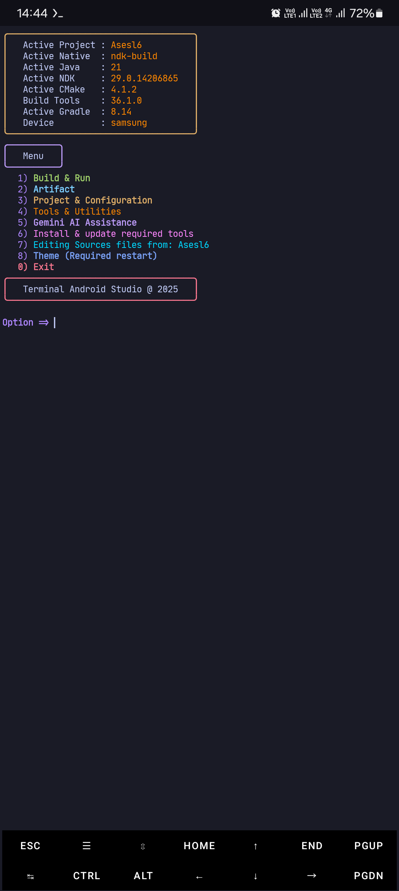
  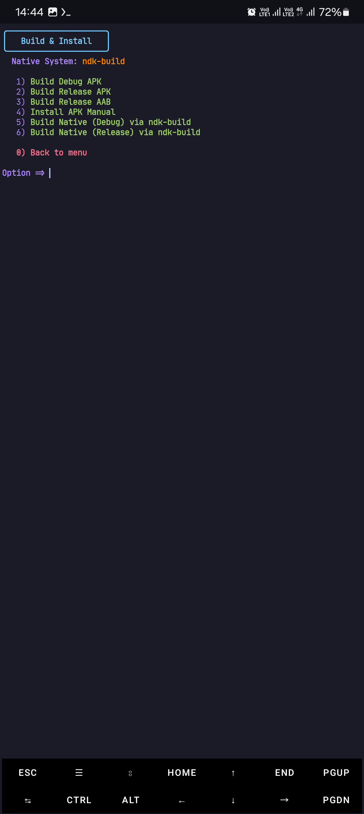
  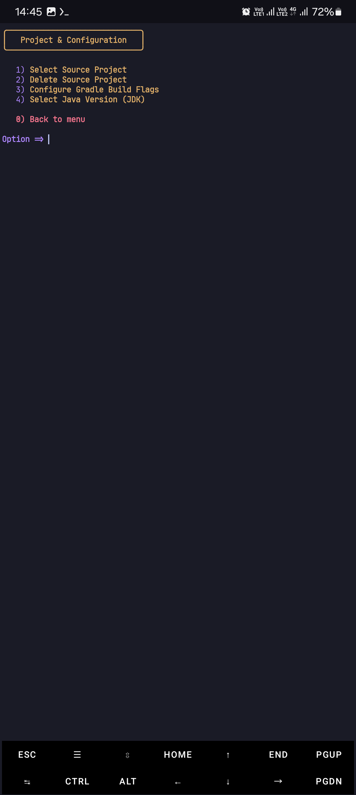
  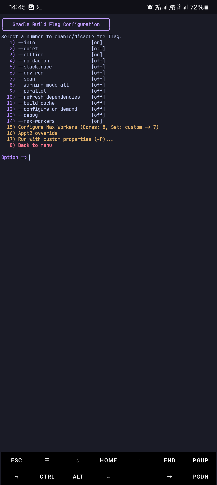
  
  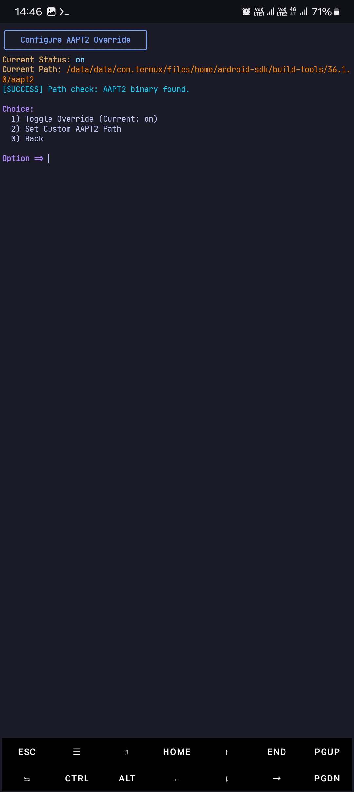
  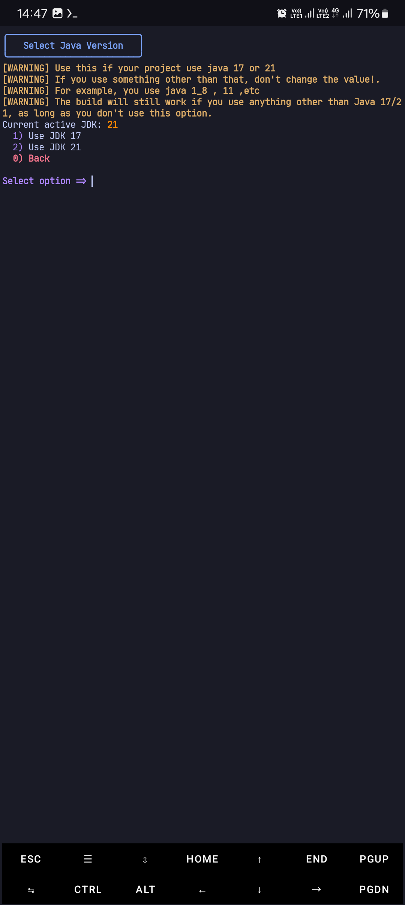
  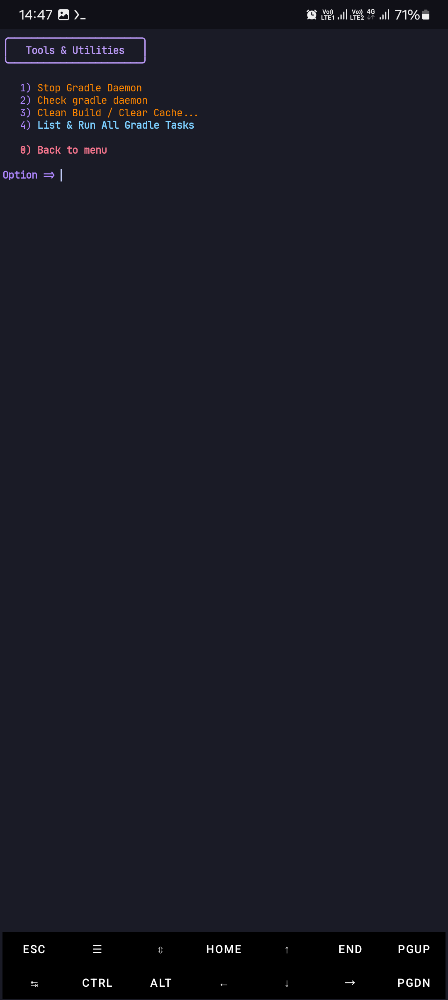
  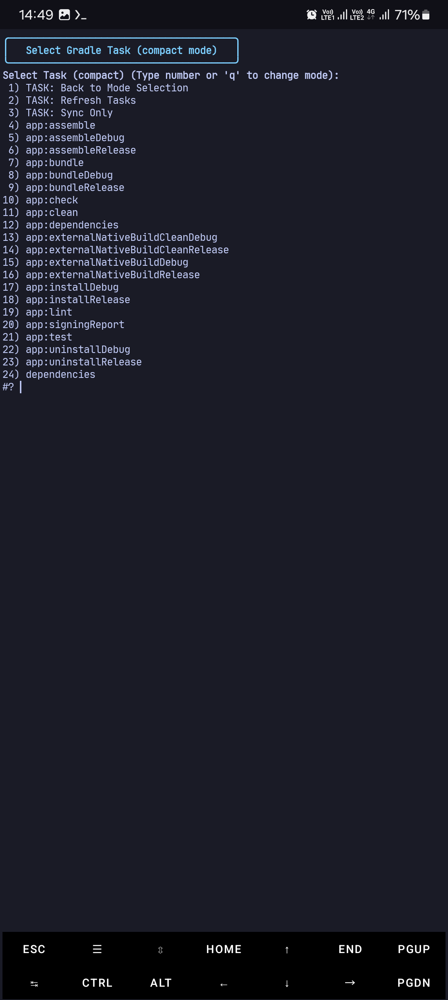
  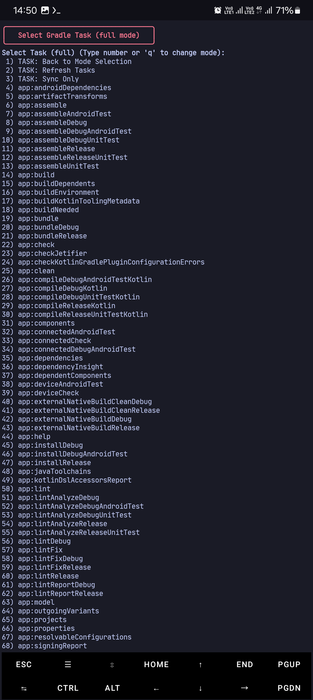
  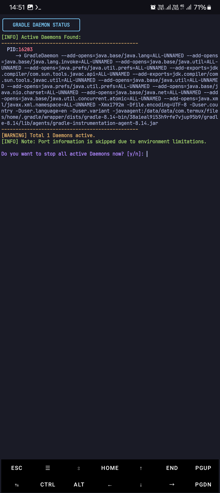
  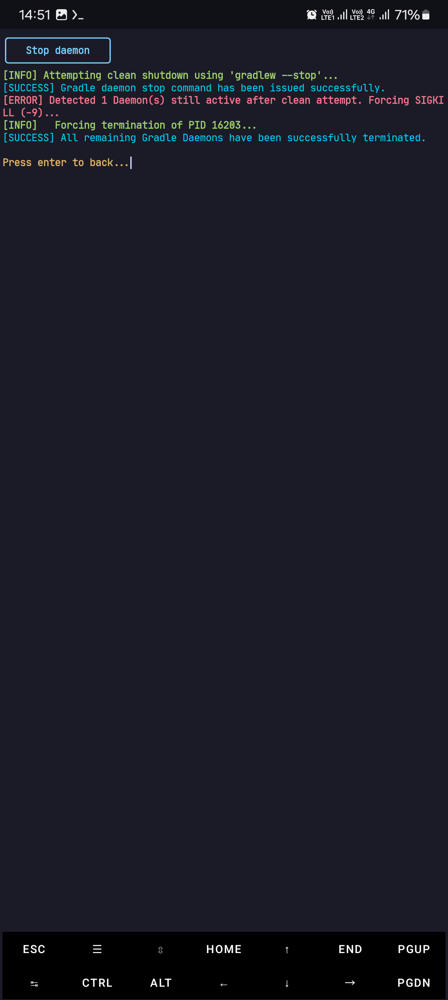
  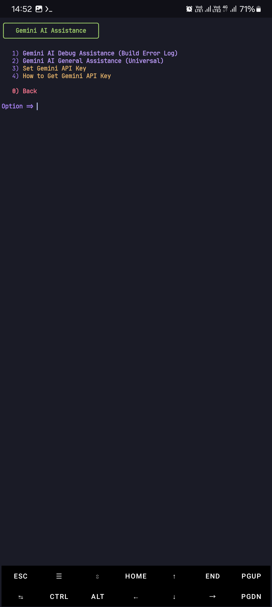
  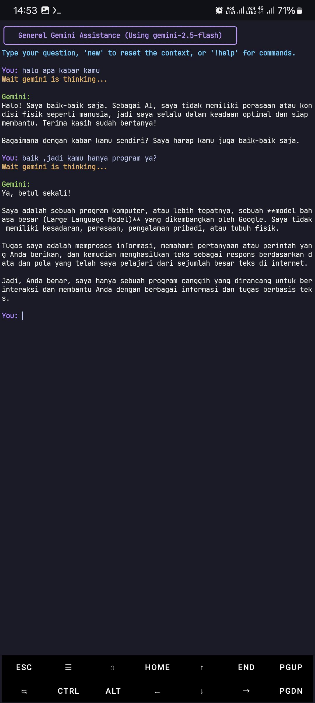
  
</div>

---

## Why Build in Termux?

- Always up-to-date tools  
- Easier project management  
- Access to many extra tools for debugging and error analysis  
- Fully customizable — easy to extend or modify features  

---

## FAQ

**Why 32-bit only (armeabi-v7a)?**  
Because it focuses on lightweight builds and compatibility with older devices.  

**Why does the build take so long?**  
It depends on CPU count, RAM size, and JVM settings.  

**Why no layout preview or GUI editing?**  
Because TAS is TUI-based, not GUI.  
While Termux GUI can be used, it’s not visually complete or optimal.

---

## Notes

TAS is made for developers who want to build Android apps entirely from the terminal,  
without depending on Android Studio’s GUI.  
It’s practical, flexible, and easy to extend with new features.
