# TAS (Terminal Android Studio) 3.0

**TAS** adalah proyek TUI (*Text User Interface*) untuk membangun APK Android langsung dari **Termux**.  
Terinspirasi dari **AndroidIDE**, tetapi dirancang sebagai perangkat berbasis terminal alih-alih antarmuka grafis (GUI).

Saat ini menargetkan `Min api 28` **armeabi-v7a (32-bit)** saja.

---
## Diuji pada agp 9.3.1 - kgp 2.4.10 - jdk 21
---

---

## Fitur

0. PERBAIKAN BUG
1. ~~Otomatis memilih dan menyalin proyek sumber untuk di-*build*~~  
2. Deteksi otomatis dan pengaturan JDK (sekaligus memperbarui `build.gradle` secara otomatis)  
3. Menyalin file hasil keluaran *build* (`.apk`, `.aab`)  
4. Deteksi otomatis versi terbaru dari JDK, CMake, NDK, Build Tools, dan lainnya  
5. Mengaktifkan/menonaktifkan *build flag* seperti info, mode *offline*, *build cache*, dan lainnya  
6. Dukungan *override* `aapt2` kustom  
7. Mengontrol jumlah *core* CPU yang digunakan untuk proses *build*  
8. Pembersihan *cache* yang aman (menghapus semua *cache build* dan dependensi yang diunduh)  
9. Opsi untuk menghentikan Gradle *daemon* secara manual  
10. Tampilan *task* Gradle ringkas (*compact*) atau tampilan *task* penuh  
11. **Asisten Gemini AI Gratis (25 Flash)**  
    - Bertanya seputar *error build*  
    - Bertanya secara umum atau mengobrol  
12. Editor menggunakan **Neovim** (dengan dukungan *autocompletion*)  
13. Tema terminal yang dapat dipilih  
14. Penambahan fitur untuk membuat *keystore* dan *sign* manual; jika *sign* belum didefinisikan di `build.gradle`, maka saat *build release*, Anda dapat menggunakan kedua fungsi ini  
15. Penambahan fitur konversi AAB ke APK  
16. Penambahan Git  
17. Penambahan instalasi APK  
18. Penambahan opsi *clean* sebelum *build*  
19. Penambahan opsi Konsol  
20. Penambahan laporan *profile*  
21. Penambahan opsi Gradle `update & backup`  
22. Penambahan dukungan lebih banyak JDK (25) *tetapi masih mengalami bug di 32-bit*, menunggu pembaruan terbaru dari `termux`  
23. Migrasi penuh proses *build* ke `/storage/AppProjects`  
24. Pembaruan antarmuka manajemen file (informasi tersedia)  
25. Penambahan helper Salin (*Copy*), Pindah (*Move*), dan Hapus (*Delete*)  
26. Penambahan Grafik Task (*release*, *debug*, *bundle*)  
27. Penambahan Gradle Kustom  
28. Penambahan konversi APK ke AAB dengan opsi `android.jar` kustom (**Eksperimental**)  
29. Penambahan pencadangan data Termux  
30. Penambahan pengecekan versi terbaru (agp, kgp, gradle wrapper)  
31. Penambahan pencadangan *dist* gradle  
32. Penambahan *formatter* java, kotlin, xml (khusus *layout*)  
33. Penambahan *auto-translate* bahasa (memperbaiki beberapa *error*)  
34. Penambahan *deprecated scanner* (java, kotlin, build.gradle.kts) — *eksperimental*  
35. Penambahan lebih banyak *build flag* (khusus gradle 9.6.1)  
36. Penambahan `jvmArg` otomatis berdasarkan RAM perangkat (jika mode *auto* diaktifkan)

---

## Cara Pemasangan (Setup)

### 1. Instalasi yang Diperlukan

Pastikan Anda sudah menginstal dan mengonfigurasi:

- Hanya instal **Termux** dari rilis GitHub resminya
- Untuk **SDK**, wajib menggunakan versi terbaru (36) agar berjalan normal, atau Anda harus mengatur *override* `aapt2` secara manual
- **Termux** (berikan izin penyimpanan dan jalankan `termux-setup-storage`), lalu buka komentar (hapus tanda `#`) pada baris `allow-external-apps = true` di dalam file **termux.properties**
- **CMake** *(opsional)* `untuk build native`
- **JDK** (melalui terminal)
- **NDK** *(opsional)* `untuk build native`

### 2. Folder Proyek

Buat folder di penyimpanan Anda untuk menampung semua sumber proyek Android:

```text
/storage/emulated/0/AppProjects/
```

Simpan proyek-proyek sumber Android di dalam folder tersebut.

---

## Tautan Terkait

- [Installer untuk CMake, SDK, NDK](https://github.com/shantoze/ALONE)  
- [CMake](https://github.com/shantoze/CFA)  
- [NDK](https://github.com/HomuHomu833/android-ndk-custom)  
- [SDK](https://github.com/HomuHomu833/android-sdk-custom)
- [Termux](https://github.com/termux/termux-app)

---

## Cara Penggunaan

1. Ekstrak **TAS** dan salin ke direktori *home* Termux Anda  
2. Berikan izin eksekusi:
   ```bash
   chmod +x TAS
   ```
3. Jalankan:
   ```bash
   ./TAS
   ```
4. Pada saat pertama kali diluncurkan:
   - Pilih **opsi 1** untuk memilih proyek sumber yang akan di-*build*  
   - Dari menu utama, pilih **Install and update** untuk mengunduh komponen yang diperlukan  
   - Sesuaikan opsi *build*, lalu mulai proses *build*-nya

---

## Tangkapan Layar (Screenshots)
<div align="center">
  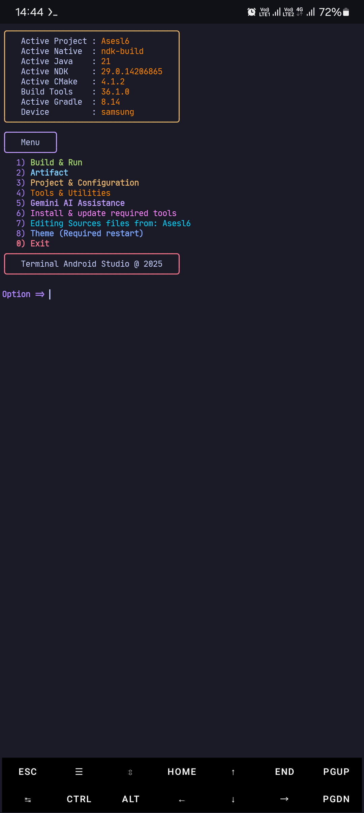
  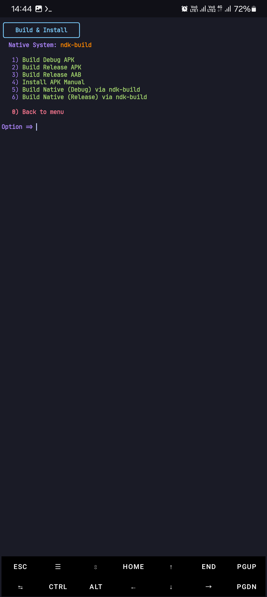
  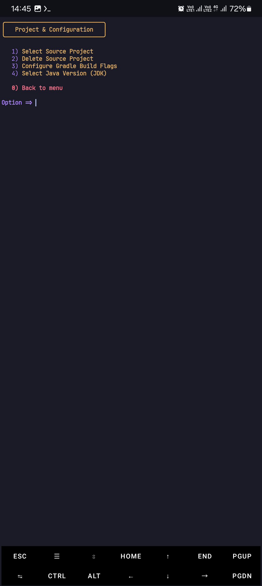
  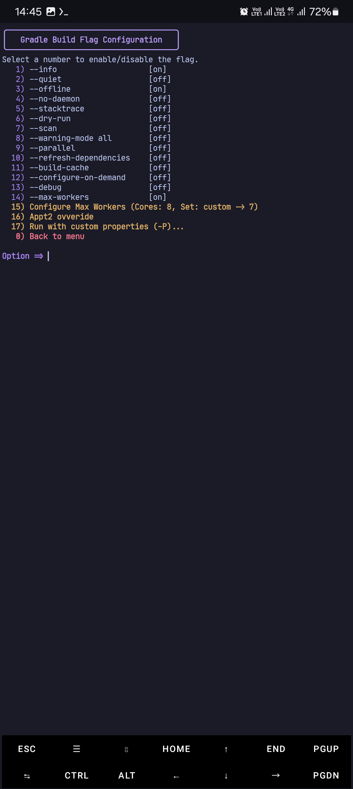
  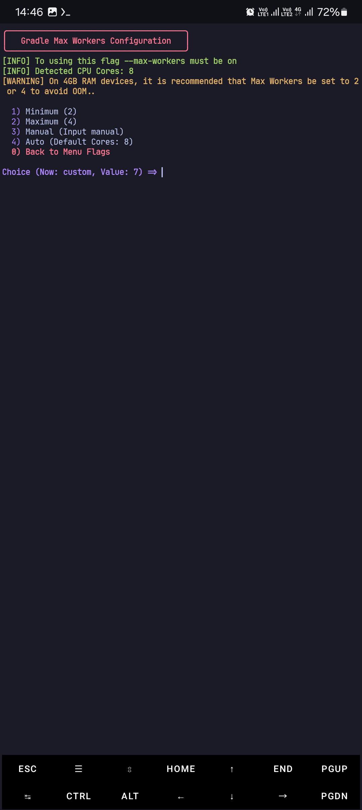
  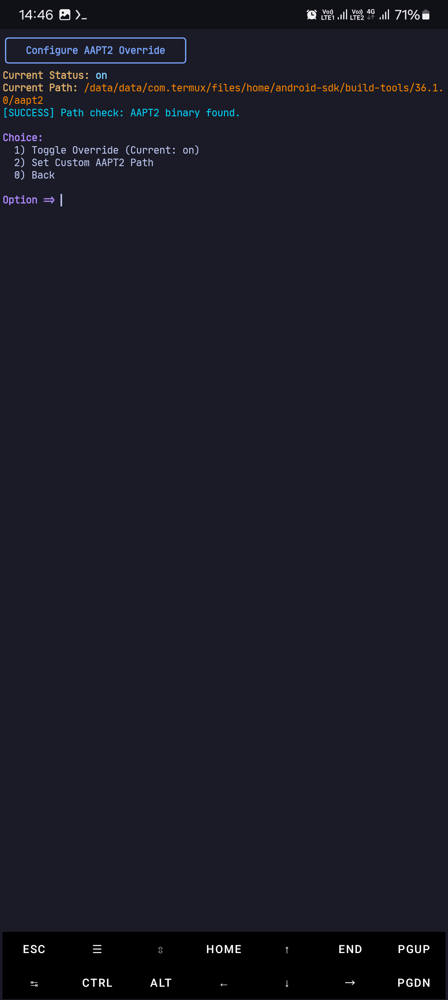
  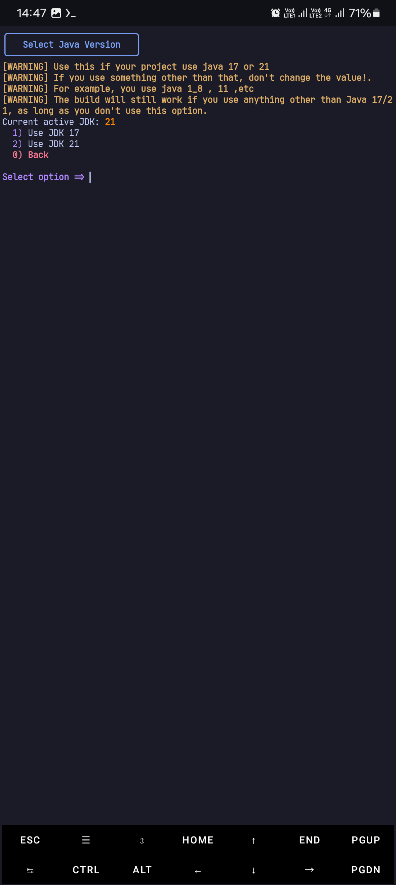
  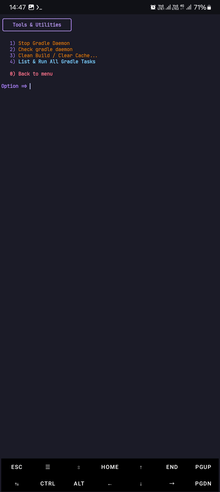
  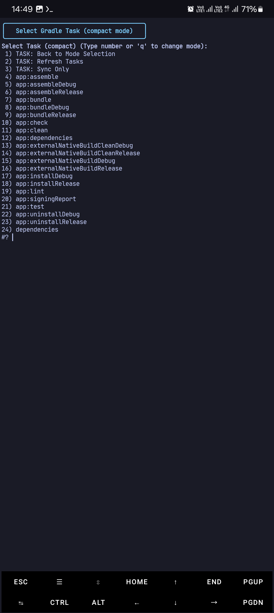
  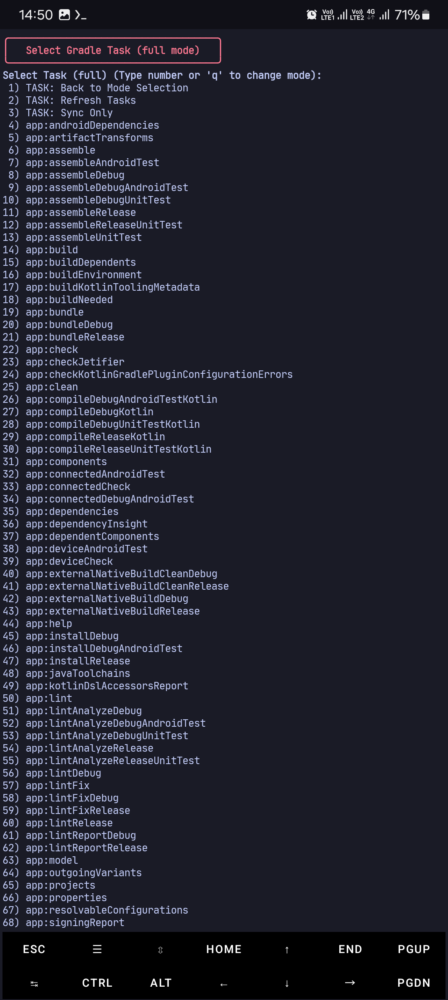
  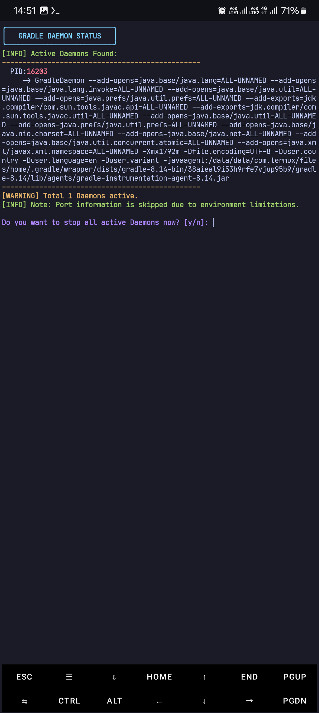
  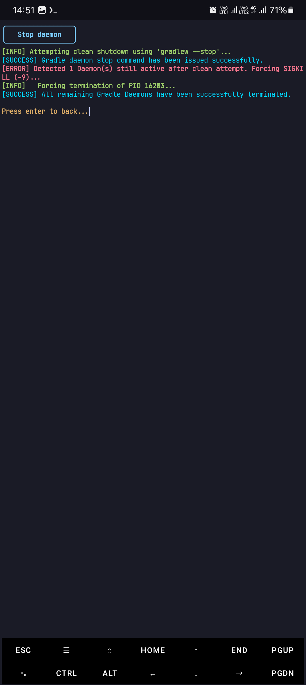
  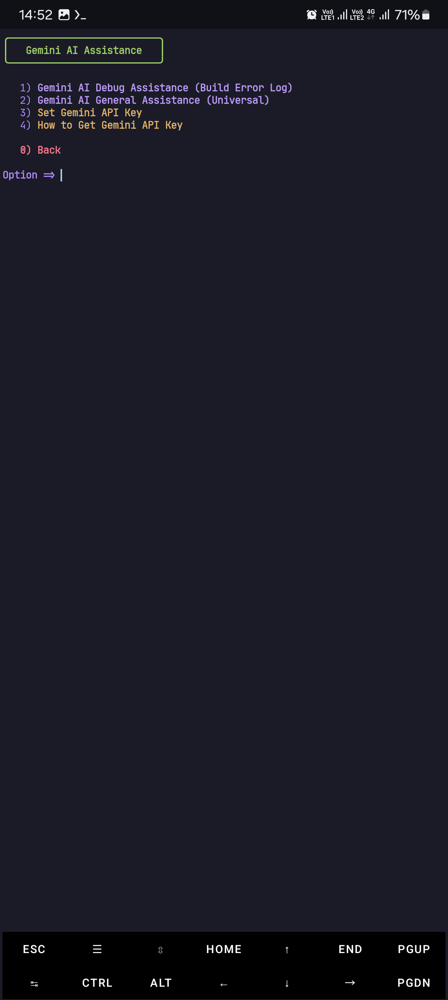
  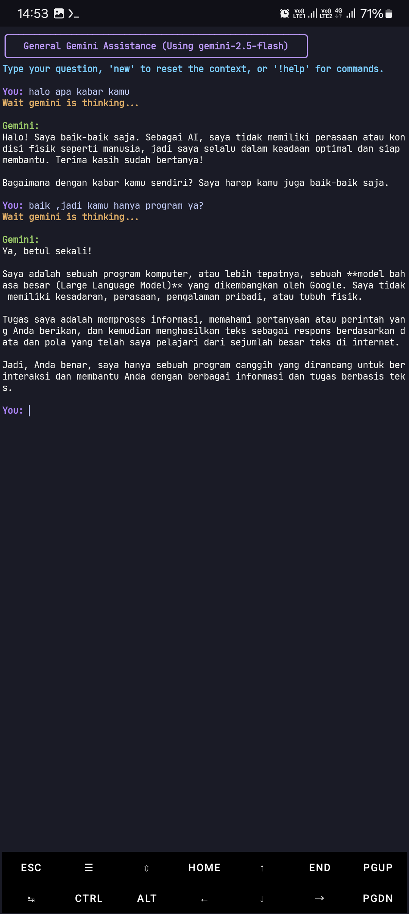
  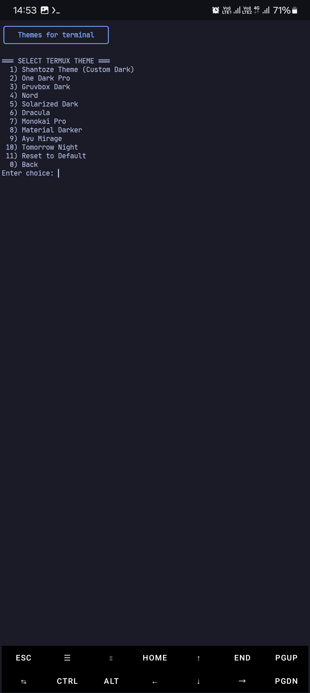
</div>

---

## Mengapa Build di Termux?

- Perangkat dan alat selalu diperbarui (*up-to-date*)  
- Manajemen proyek menjadi lebih mudah  
- Akses ke banyak perangkat tambahan untuk proses *debugging* dan analisis *error*  
- Sepenuhnya dapat dikustomisasi — mudah untuk memperluas atau memodifikasi fiturnya  

---

## Catatan
**Jika Anda menggunakan versi terbaru, pastikan untuk menjalankan menu Install and update terlebih dahulu.**

TAS dibuat untuk para pengembang yang ingin membangun aplikasi Android sepenuhnya dari terminal,  
tanpa bergantung pada GUI.  
Praktis, fleksibel, dan mudah dikembangkan dengan fitur-fitur baru.

---

# Kredit (Credits)

`Mas Indra Setiawan` (untuk pengujian dan umpan balik/feedback)
